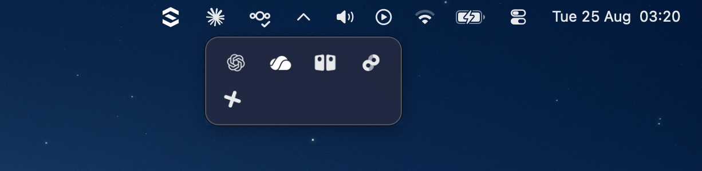
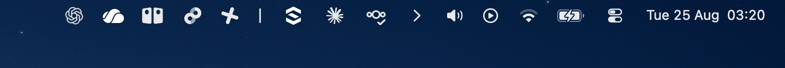
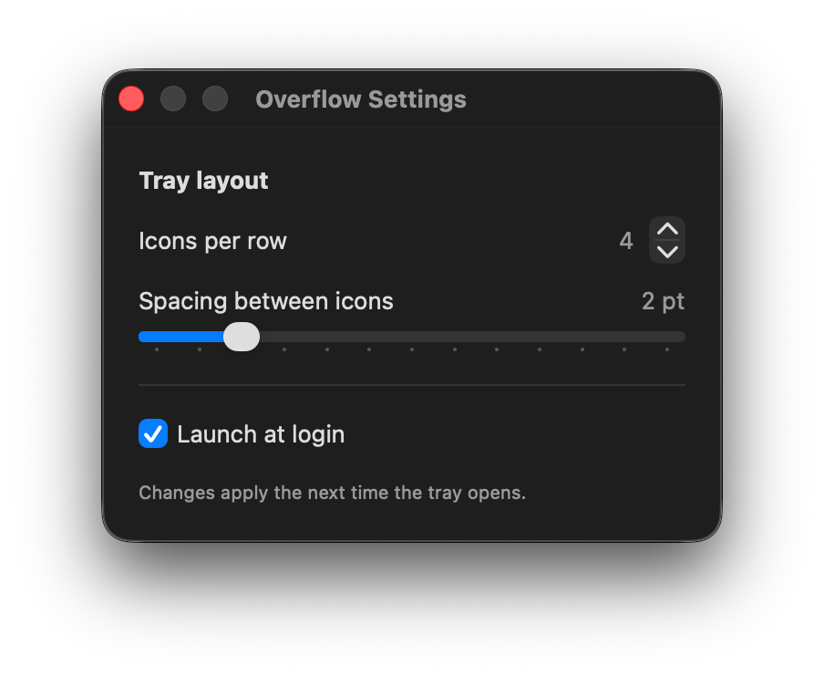
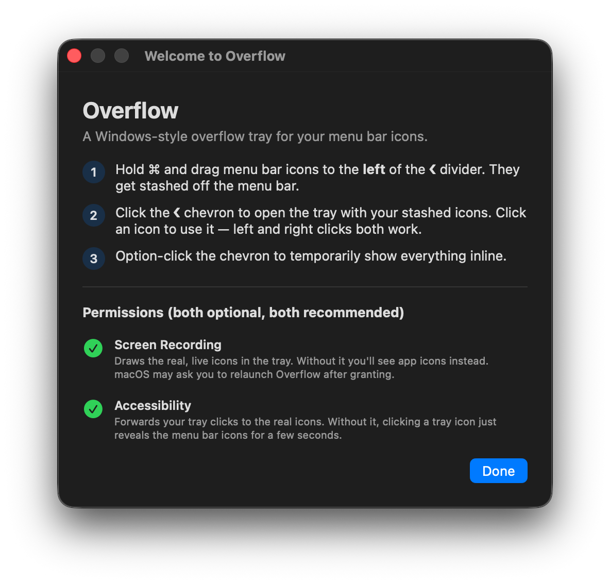

# Overflow

A Windows-style overflow tray for macOS menu bar icons.

Stash the icons you rarely need behind a chevron. Click it and they appear
in a popout tray under the menu bar — click one there and it works exactly
as if it were still in the bar.



## Why

Menu bars fill up fast (and the notch makes it worse). Existing hiders like
Hidden Bar just shove icons off-screen — to use one you have to un-hide
everything first. Overflow keeps them one click away in a tray, the way the
Windows system tray has done forever.

## How it works

- **Stash icons**: hold ⌘ and drag menu bar icons to the **left** of the
  thin `|` divider. They're pushed off the menu bar.

  

  *(shown inline-expanded — everything left of the `|` gets stashed)*

- **Open the tray**: click the `v` chevron. Stashed icons show up at their
  real size, in rows. Click any icon — left or right click — and Overflow
  forwards the click to the real item: it briefly slides back into the bar,
  its menu opens right where you'd expect, and it re-stashes automatically
  when the menu closes.
- **Show everything inline**: option-click the chevron (or use the
  right-click menu). The chevron flips to `❯`; click it again to re-stash.
- **Settings**: right-click the chevron → *Settings…* — icons per row,
  spacing between icons, launch at login.

  

The chevron tells you the state at a glance: `v` at rest, `^` while the
tray is open, `❯` when everything is shown inline.

## Permissions

Both optional, both recommended — the app degrades gracefully without them:

- **Screen Recording** — used to photograph the stashed icons so the tray
  shows the real, live images. Without it you get generic placeholders.
- **Accessibility** — used to forward tray clicks to the real items via
  synthetic mouse events. Without it, clicking a tray icon just reveals the
  menu bar icons for 8 seconds so you can click the real one.



## Building

Works with Command Line Tools only (no Xcode needed):

```bash
CODESIGN_IDENTITY="Your Dev Cert" Scripts/build-app.sh
rm -rf /Applications/Overflow.app && cp -R build/Overflow.app /Applications/
```

Sign with a stable identity (a self-signed code-signing certificate works) —
macOS ties TCC permissions to the code signature, so ad-hoc signing re-asks
for permissions on every rebuild. Install by `rm -rf` + `cp -R`, never by
copying over the existing bundle.

The app icon comes from `SupportFiles/AppIcon-source.png` (1024×1024 with
transparent squircle corners). After replacing it, regenerate
`SupportFiles/AppIcon.icns` with `Scripts/make-icns.sh`.

## macOS 26 (Tahoe) implementation notes

These constraints shaped the design; they differ from what Hidden Bar / Ice
era write-ups describe:

- **Status items are hosted out-of-process by Control Centre.** Every
  status-item window (layer 25) is owned by the Control Centre process, so
  window ownership can no longer identify which app an item belongs to.
- **Each item has one window copy per display**, and a display whose menu
  bar auto-hides parks its entire row off-screen. Scans must be restricted
  to a single display's menu-bar row (y-band filter) to avoid duplicates and
  false "stashed" positives.
- **Off-screen windows cannot be captured.** Both
  `SCScreenshotManager` (error -3811) and the legacy
  `CGWindowListCreateImage` (nil) refuse windows that are fully off-screen,
  even though `SCShareableContent` lists them. Hence the cache-and-flash
  strategy: icons are photographed while visible (at launch, and via a brief
  ~0.5 s reveal when the tray needs an image it doesn't have — *Refresh Icon
  Images* in the right-click menu forces one).
- **The 10,000-point separator trick still works** for pushing items
  off-screen (the system clamps the window to ~5,000 pt but behavior is
  unchanged), and `NSStatusBarButton.window` still reports a real
  on-screen frame, so popout anchoring works.
- Re-stash timing after a forwarded click can't watch the target app's
  windows (ownership is useless) — instead a watcher looks globally for new
  transient windows (menus/popovers/panels) and re-stashes when they close.

## Debugging

```bash
defaults write com.bnewable.Overflow debugLogging -bool true
```

then watch `/tmp/overflow-state.log` for flash-capture stats.
